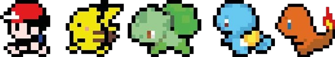
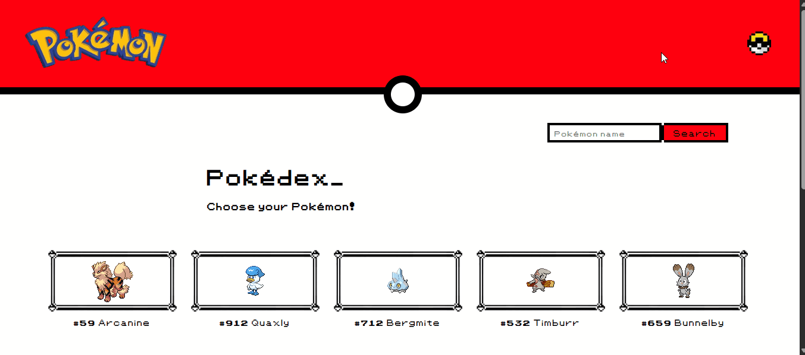
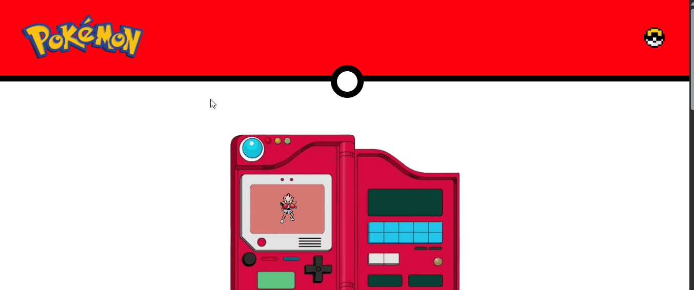
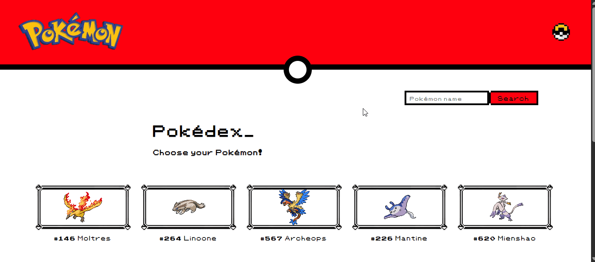
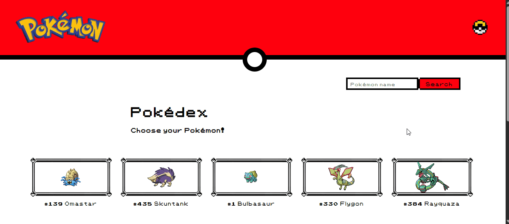
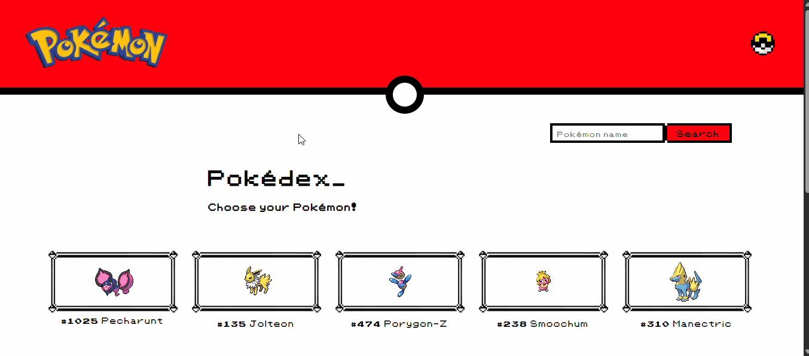

<div align="center">
    <h1>
        
        Projeto Pokédex - Pokémon
        
    </h1>
    <p style="margin-top: 25px;">Projeto desafio DevQuest, o qual reúne informações de diversos pokémons através da API <a href="https://pokeapi.co/" target="_blank">🔗PokéAPI</a>, como imagem, nome, movimentos, habilidades e seus efeitos, bem como o seu(s) tipo(s).</p>
</div>

<p align="center" style="margin-top: 50px;">
    
    
    
    
    
    
    
    
    
    
    
    
</p>

<h4 align="center" style="margin-bottom: 50px;">⚠️ Projeto finalizado ⚠️</h4>

* [Funcionalidades e Demonstração da Aplicação](#funcionalidades-e-demonstração-da-aplicação)
* [Acesso ao Projeto](#acesso-ao-projeto)
* [Tecnologias utilizadas](#tecnologias-utilizadas)
* [Autor](#autor)
* [Licença](#licença)
* [Direitos](#direitos)


# Funcionalidades e Demonstração da Aplicação 

- `Funcionalidade 1:` o projeto possui a opção de alteração do tema, entre "claro" e "escuro". Para isso, basta clicar no ícone de pokébola, situado no canto superior direito:



- `Funcionalidade 2:` a logo Pokémon, ao ser clicada, retorna para a página inicial da aplicação:



- `Funcionalidade 3:` aplicação possui um campo de busca, para filtrar a pesquisa através do nome (em inglês) do pokémon requerido. Caso o nome pesquisado não exista, uma mensagem é informada logo abaixo ao campo:



- `Funcionalidade 4:` botão para mostrar mais 10 (dez) pokémons na lista. A API PokéAPI disponibiliza informações de 1025 pokémons, distribuídos ao longo das gerações do desenho animado:



- `Funcionalidade 5:` ao clicar sobre um pokémon na tela inicial, suas informações principais serão exibidas, sendo elas:
    * Movimentos
    * Habilidade(s)
    * Efeitos de cada habilidade
    * Tipo(s)



- `Funcionalidade 6:` na página das informações detalhadas do pokémon, há um botão para exibir mais movimentos, uma vez que a lista pode ser extensa.

- `Funcionalidade 7:` a exibição dos efeitos referentes a cada habilidade foi construído sob a ideia de um acordeão.

# Acesso ao projeto 

#### Pré-requisitos

Antes de começar, você vai precisar ter instalado em sua máquina as seguintes ferramentas:
[Git](https://git-scm.com), [Node.js](https://nodejs.org/en/). 
Além disto é bom ter um editor para trabalhar com o código como [VSCode](https://code.visualstudio.com/).

### Rodando na própria máquina

Abra o terminal, e siga os passos abaixo:

1) Clone o repositório

```
git clone https://github.com/Hugo-Moreira91/pokedex-pokemon.git
```

2) Navegue até a pasta do projeto

```
cd pokedex-pokemon
```

3) Instale as dependências do projeto (usando gerenciador de pacotes NPM)

```
npm install
```

ou simplesmente

```
npm i
```

4) Inicie o projeto

```
npm start
```

### Via GitHub Pages

Caso seja do seu interesse, pode acessar o projeto rodando de forma online. Basta clicar [🔗aqui](https://hugo-moreira91.github.io/pokedex-pokemon/)!

# Tecnologias utilizadas 

* React + Vite
* Componentes
* Node.js
* JSON
* Axios
* Hooks
* Single Page Application (SPA)
* React Router DOM
* React Context API
* Styled-components 

# Autor 

<div style="display: flex; flex-direction: column; align-items: flex-start; justify-content: center; gap: 25px">
    <a href="https://github.com/Hugo-Moreira91">
        
        <sub style="display: block; margin-top: 10px; color: #fff;">Hugo César Santos Moreira</sub>
    </a>
    <p>Feito com ❤️</br>Entre em contato! 👇🏼</p>
</div>

[](https://www.linkedin.com/in/hugo-c%C3%A9sar-santos-moreira-a10823248/)
[](mailto:hugo.cesar91@gmail.com)

# Licença

<p>O projeto Pokédex - Pokémon é licenciado pelo MIT. Para mais detalhes, acesse o arquivo da licença clicando <a href="./LICENSE">🔗aqui</a>.</p>

# Direitos

<p>Pokémon&reg é uma marca registrada da <i>Nintendo</i>, <i>Game Freaks</i> e <i>Creatures</i>. Todos os direitos reservados.</p>