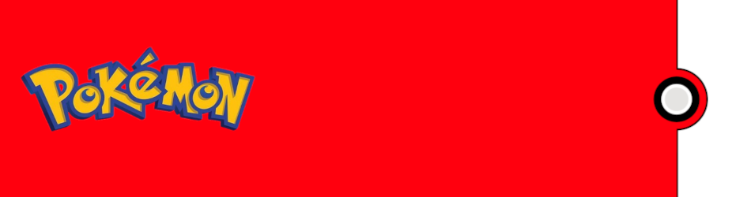
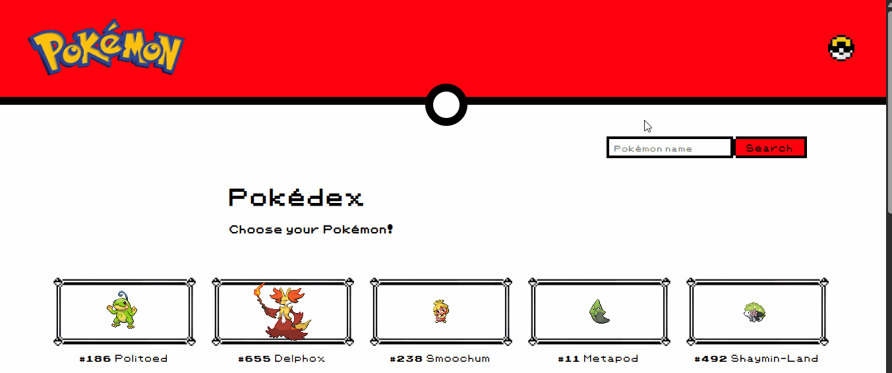
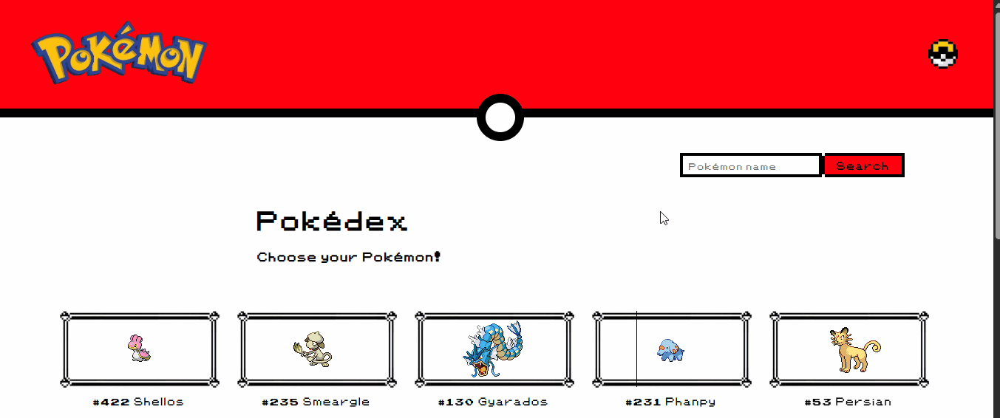
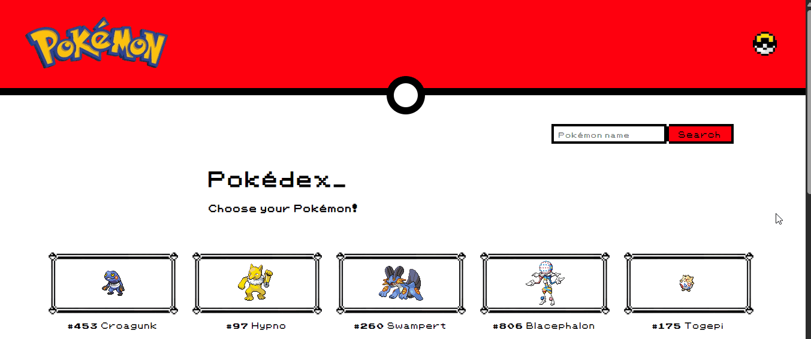
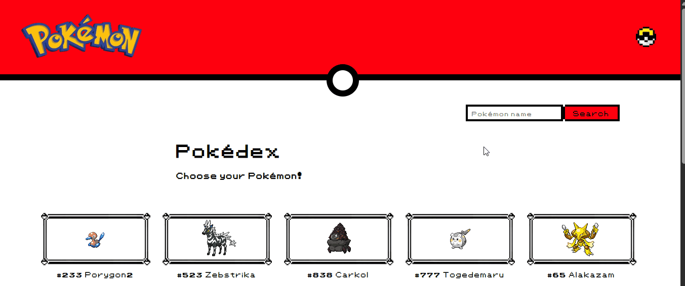

    <h1>
        
        Projeto Pokédex - Pokémon
        
    </h1>
    
    
Projeto desafio DevQuest, o qual reúne informações de diversos pokémons através da API <a href="https://pokeapi.co/" target="_blank">🔗PokéAPI</a>, como imagem, nome, movimentos, abilidades e seus efeitos, bem como o seu(s) tipo(s).

    
    
    
    
    
    
    
    
    
    
    
    

<h4 align="center" style="margin-bottom: 50px;">⚠️ Projeto finalizado ⚠️</h4>

* [Funcionalidades e Demonstração da Aplicação](#funcionalidades-e-demonstração-da-aplicação)
* [Acesso ao Projeto](#acesso-ao-projeto)
* [Tecnologias utilizadas](#tecnologias-utilizadas)
* [Pessoas Contribuidoras](#pessoas-contribuidoras)
* [Autor](#autor)
* [Licença](#licença)
* [Conclusão](#conclusão)

# Funcionalidades e Demonstração da Aplicação

- `Funcionalidade 1:` o projeto possui a opção de alteração do tema, entre "claro" e "escuro". Para isso, basta clicar no ícone de pokébola, situado no canto superior direito:

- `Funcionalidade 2:` a logo Pokémon, ao ser clicada, retorna para a página inicial da aplicação:

- `Funcionalidade 3:` aplicação possui um campo de busca, para filtrar a pesquisa através do nome (em inglês) do pokémon requerido. Caso o nome pesquisado não exista, uma mensagem é informada logo abaixo ao campo:

- `Funcionalidade 4:` botão para mostrar mais 10 (dez) pokémons na lista. A API PokéAPI disponibiliza informações de 1025 pokémons, distribuídos ao longo das gerações do desenho animado:

- `Funcionalidade 5:` ao clicar sobre um pokémon na tela inicial, suas informações principais serão exibidas, sendo elas:
    * Movimentos
    * Abilidade(s)
    * Efeitos de cada abilidade
    * Tipo(s)

- `Funcionalidade 6:` na página das informações detalhadas do pokémon, há um botão para exibir mais movimentos, uma vez que a lista pode ser extensa.

- `Funcionalidade 7:` a exibição dos efeitos referentes a cada abilidade foi construído sob a ideia de um acordeão.